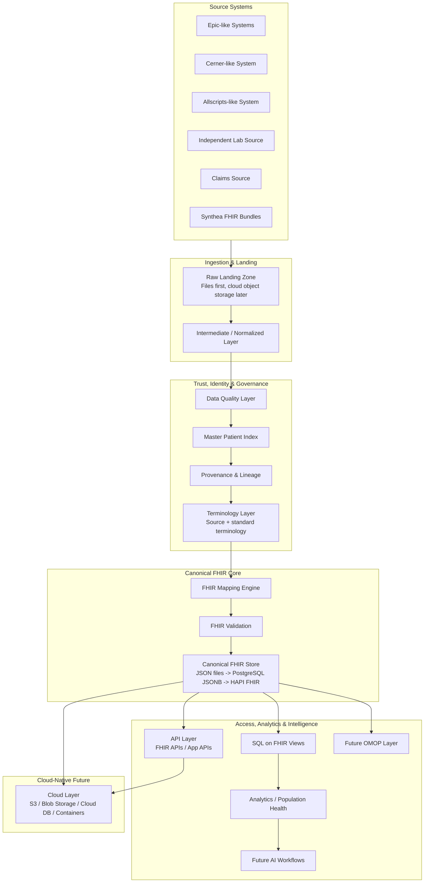

# FHIRBridge Architecture Diagram V1

## Target Architecture

## Design Notes

FHIRBridge starts locally with file-based storage, then evolves toward PostgreSQL JSONB, HAPI FHIR, SQL on FHIR, and cloud-native deployment.

The Terminology Layer, API Layer, and Cloud Layer are included in V1 because they are part of the long-term enterprise target architecture, even if not fully implemented in Phase 1A.

Security, consent, privacy, audit, access control, and PHI governance are recognized as future extensibility areas when the project evolves beyond synthetic data.

## Future Extensibility Areas

- Security
- Consent
- Privacy
- Audit
- Access Control
- PHI Governance